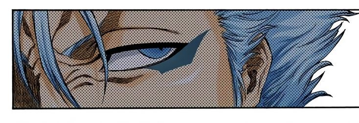

###

<h4 align="center">Languages / Tools I have worked with:</h4>

###

  
  
  
  
  
  
  
  
  
  
  
  
  
  
  
  
  
  
  
  
  
  
  

###

<h6 align="center">Socials:</h6>

###

  

###

  

###

  

###

 

###

  

###
